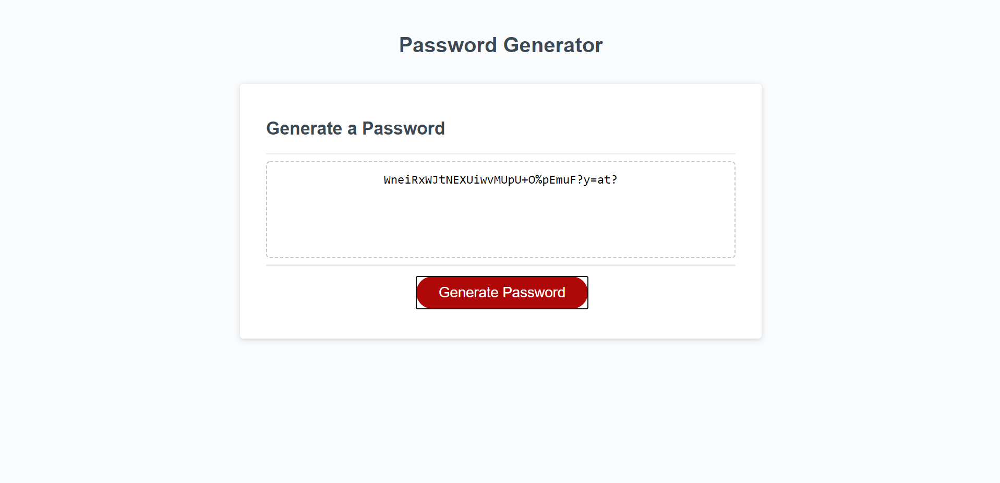

# password-generator

## Purpose
A password generator that generates a randomized password based on user selected criteria. When the user clicks on the "Generate Password" button, the user is presented with a series of window prompts
to select the desired characters. If at least one type of character is selected, the user is prompted with desired password length. If the desired length(x) fulfills all requirements (x >=8, x <=128, is not a value, isNaN), then the password is randomaly generated and printed to the screen replacing "Your Secure Password." Clicking the button a second time reinitiates the process.     

## Made With
* HTML
* CSS
* JAVASCRIPT

## Deployed URL
https://carrington13.github.io/password-generator/

## Screenshot

## Contributions
Starter code provided (html, css, basic JS framework), JS functionality and bulk of JS content by Casey Arrington.
Code refactoring by Casey Arrington
